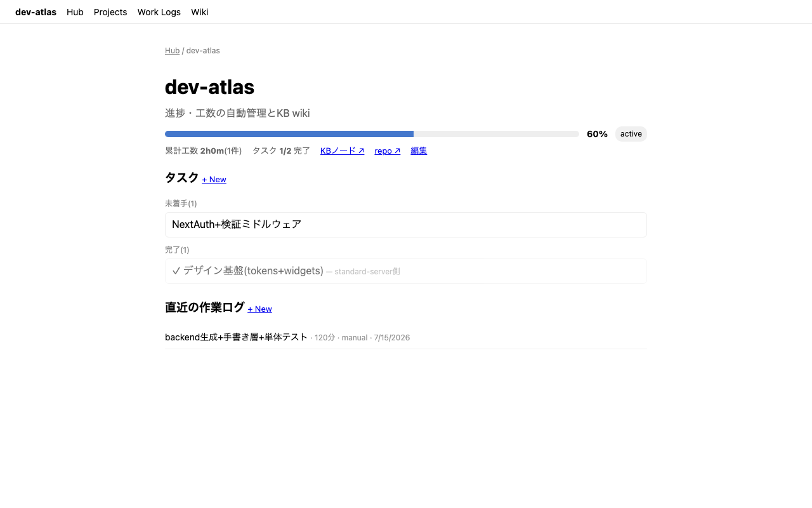
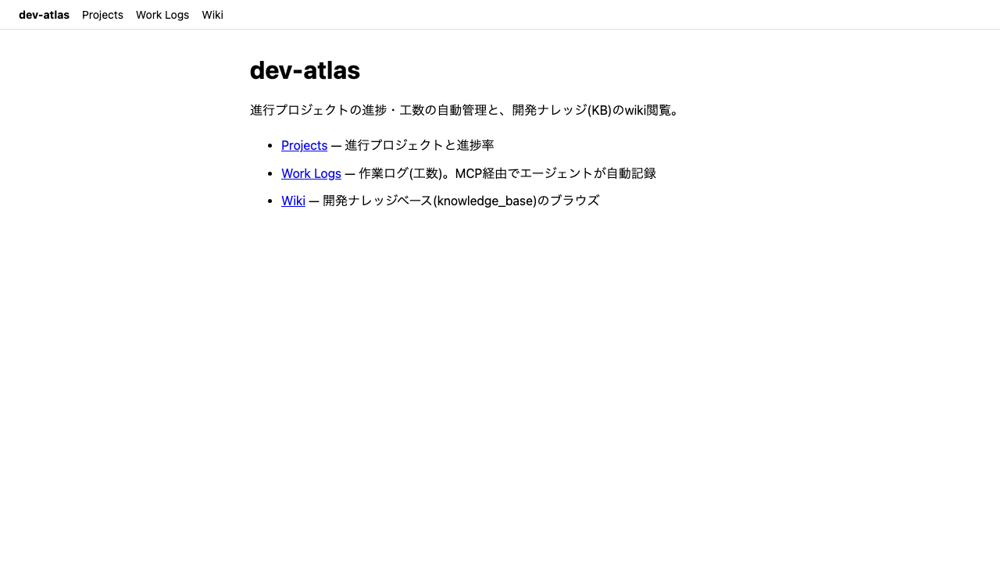
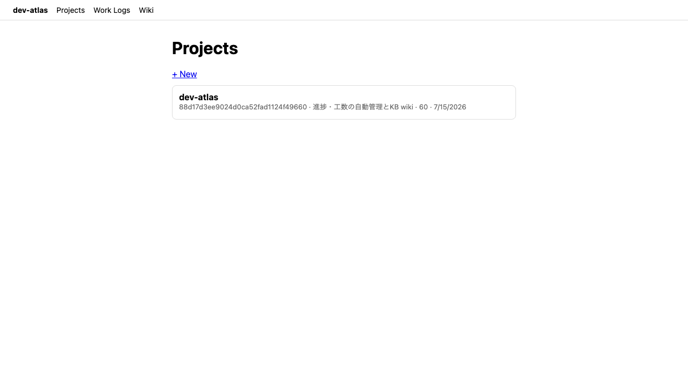
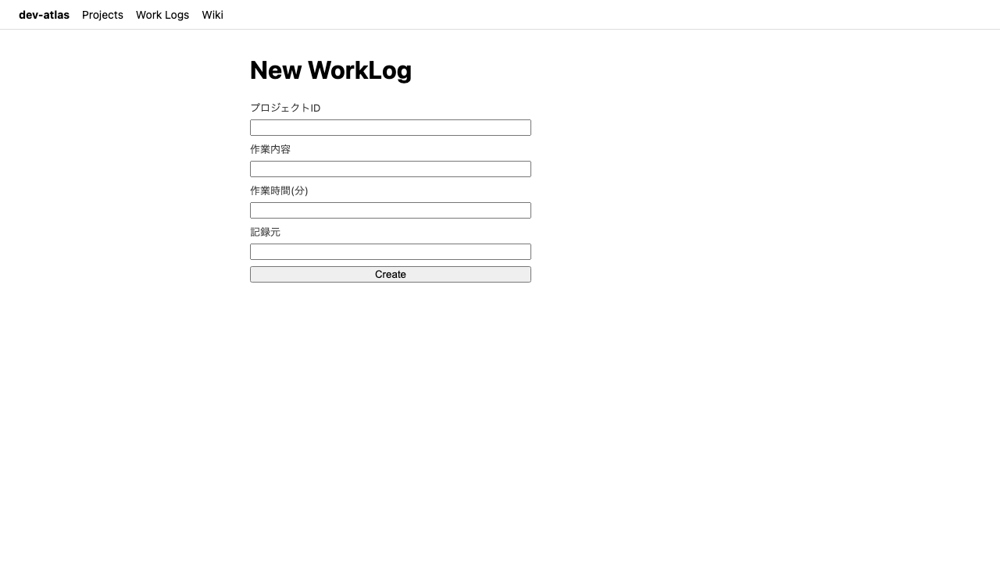
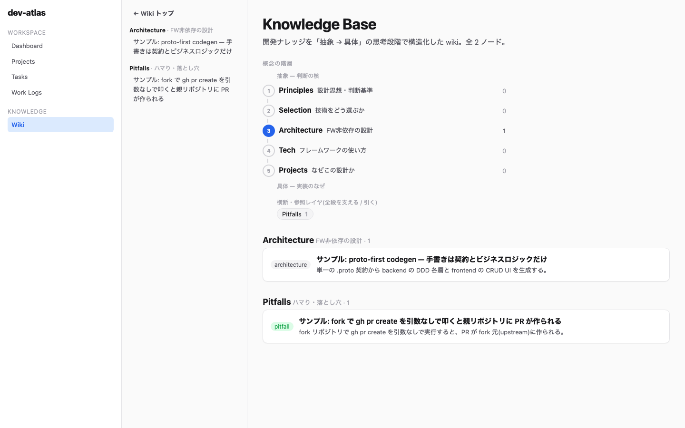

# dev-atlas

**進行プロジェクトの進捗・工数の自動管理 + 開発ナレッジ(KB)の wiki 閲覧を行う Web アプリ / MCP サーバー。**

「knowledge base = 地図、プロジェクトの進捗 = 現在地」を1つの画面に集めることで、
自分(と自分のAIエージェント)が「いま何がどこまで進んでいて、過去に何を学んだか」を
手を煩わせず把握できるようにする。

## 特徴

- **入力**: Web のフォーム、または **MCP ツール経由でコーディングエージェント(Claude Code 等)が自動記録**
  (作業の区切りで `log_work`、進捗変化で `update_progress` を呼ぶ)
- **処理**: 工数の集計(プロジェクト別の累計分数)、進捗検証(0–100・状態遷移語彙)、
  KB の wikilink(`[[名前]]`)解決・全文検索
- **出力**: プロジェクト/工数の CRUD 画面、`project_status`(現状サマリー)、KB wiki ビューア

## アーキテクチャ — proto-first codegen(standard-server の dogfooding)

このアプリのコードの大半は手書きではなく、[manji-standard-server](https://github.com/Akatuki25/manji-standard-server)
(proto-first codegen 基盤。fork して Python/FastAPI スタックと Next.js web スタックを自作)から**生成**している。

```
proto/atlas/v1/atlas.proto   ← 手書きはこの契約(単一の真実)
    │ mss-protoc-gen(python)          │ mss-protoc-gen(web)
    ▼                                  ▼
backend: DDD 9層×2エンティティ        web: 型/APIクライアント/CRUD UI/pages
(entity/dto/repository/mock/          (優先度カードリスト・validation付フォーム)
 infra/usecase IF/handler/di/registry)
    │ mss-migration-gen
    ▼
migrations/*.up.sql(起動時に冪等適用)
```

手書きしたのは: 契約(proto)/ ビジネスロジック(service・usecase)/ KB wiki ビューア / MCP サーバー / main の wiring のみ。

```
dev-atlas/
├── proto/atlas/v1/atlas.proto   # 契約(Project / WorkLog)
├── backend/                     # FastAPI + 生成DDD層 + MCP(:8000)
├── web/                         # Next.js + 生成CRUD UI + wiki(:3000)
├── examples/kb-sample/          # サンプルKB(そのまま動かせる)
└── docker-compose.yml           # db + api + web
```

## 実行方法(Docker)

前提: Docker(Compose v2)。

```bash
git clone https://github.com/Akatuki25/dev-atlas.git
cd dev-atlas
docker compose up --build
```

- Web UI: http://localhost:3000
- API(OpenAPI): http://localhost:8000/docs
- MCP: http://localhost:8000/mcp (streamable HTTP)

自分の knowledge base(Markdown wiki)を閲覧したい場合はマウント先を指定する:

```bash
KB_HOST_PATH=$HOME/knowledge_base docker compose up --build
```

未指定の場合は同梱の `examples/kb-sample/` がマウントされ、そのまま動作を確認できる。

## 使い方

### 1. Web から

1. http://localhost:3000/projects → `+ New` でプロジェクト登録(名前・ゴール・状態・進捗率)
2. http://localhost:3000/work_logs → 作業ログ(工数・分)を記録
3. http://localhost:3000/wiki → KB を閲覧。`[[名前]]` リンクはファイル名/frontmatter id/aliases から解決

### 2. エージェントから(MCP) — このアプリの本命

Claude Code に登録:

```bash
claude mcp add --transport http dev-atlas http://localhost:8000/mcp
```

登録すると、エージェントが以下のツールを使えるようになる:

| ツール | 用途 |
|---|---|
| `list_projects` | プロジェクト一覧(id・状態・進捗率) |
| `create_project` | プロジェクト登録 |
| `project_status` | 現状把握: 進捗・累計工数・タスク集計・直近ログ |
| `update_progress` | 進捗率(0–100)・状態(active/paused/done)の更新 |
| `log_work` | **作業ログの自動記録**(コミット・タスク完了の区切りで呼ばせる) |
| `list_tasks` / `create_task` / `complete_task` | タスクの参照・分解・完了(エージェントがタスク駆動で進捗を刻む) |
| `search_kb` | KB の全文検索 |
| `read_kb_node` | KB ノードを名前で読む |

例: セッション終了時に「今日の作業を dev-atlas に記録して」と言うだけで、
エージェントが `log_work`(工数)と `update_progress`(進捗)を呼び、人間は Web で眺めるだけになる。

## 動作画面

| 画面 | |
|---|---|
| **Project Hub**(進捗・タスク・工数・KBを1画面に) |  |
| ホーム |  |
| プロジェクト一覧(優先度カードリスト・生成UI) |  |
| 作業ログ登録フォーム(生成UI・validation付) |  |
| KB wiki ビューア(wikilink解決・frontmatterチップ) |  |

## 開発(コード生成)

契約を変えたら生成器を回す(生成物は手編集しない):

```bash
# backend(要 protoc)
cd backend && uv sync
uv run tools/mss-protoc-gen/main.py atlas/v1/atlas.proto
uv run tools/mss-migration-gen/main.py
uv run pytest tests

# web
cd web && npm ci
npm run gen -- atlas/v1/atlas.proto
npm run build
```

生成器の不具合・不足は dev-atlas 側で握りつぶさず [standard-server](https://github.com/Akatuki25/manji-standard-server) へ還流する
(このアプリの開発中にも makedirs 漏れ / proto パス固定 / 数値フォーム未対応 / lint 5件を還流済み)。

## ライセンス / 出自

- scaffold: [manji-standard-server](https://github.com/JavaLangRuntimeException/manji-standard-server) の
  [自分の fork](https://github.com/Akatuki25/manji-standard-server)(Python スタック・web スタックは自作)
- このリポジトリはソフトウェア工学 期末課題7(AI駆動開発)の成果物を兼ねる(開発は Claude Code で実施)
